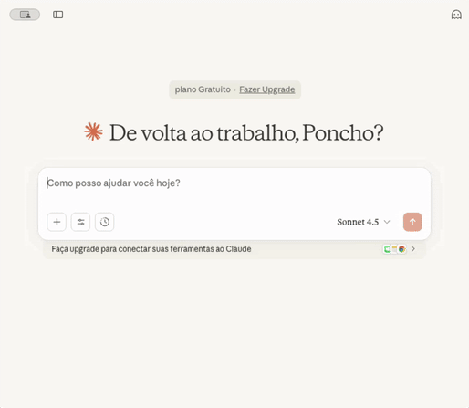
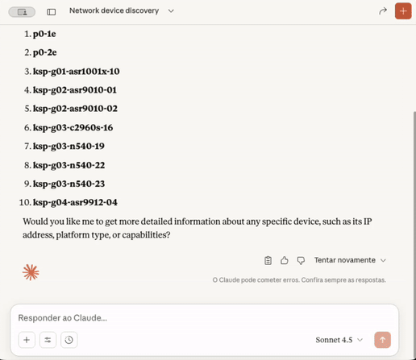
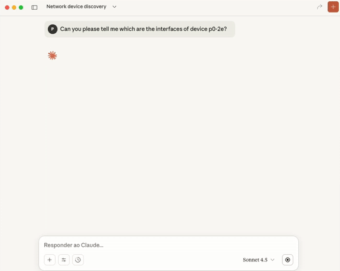
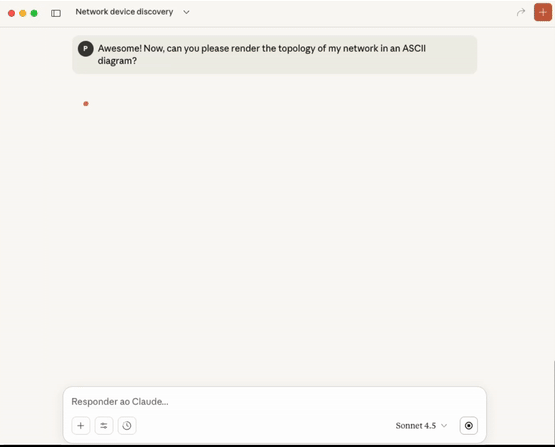

<h1 align="center">✨🤖 Cisco RADKit MCP Server<br /><br />
<div align="center">

</div>

<div align="center">
<a href="https://developer.cisco.com/codeexchange/github/repo/CiscoDevNet/radkit-mcp-server-community"></a>


</div>
<div align="center">
<a href="https://deepwiki.com/CiscoDevNet/radkit-mcp-server-community"></a>
<a href="https://www.youtube.com/watch?v=lsj05owx2Q0">
  
</a>
</div>

</h1>

<div align="center">
A <strong>stand-alone MCP server</strong> built with <a href="https://github.com/modelcontextprotocol/fastmcp"><strong>FastMCP</strong></a> that exposes key functionalities of the <a href="https://radkit.cisco.com/"><strong>Cisco RADKit</strong></a> SDK as MCP tools.  
</br>It is designed to be connected to any <strong>MCP client</strong> and <strong>LLM</strong> of your choice, enabling intelligent interaction with network devices through Cisco RADKit.
<br /><br />
</div>

> **Disclaimer**: This MCP Server is not an official Cisco product. It was developed for experimentation and learning purposes.

## 🚀 Overview

This MCP server acts as a lightweight middleware layer between the **Cisco RADKit** service and an **MCP-compatible client**.  
It allows the LLM to inspect and interact with devices onboarded in the RADKit inventory, fetch device attributes, and even execute CLI commands — all through structured MCP tools.

## ⚙️ Features

### Core Features
- 🔌 **Plug-and-play MCP server** — works with any MCP-compatible client.
- 🔍 **Inventory discovery** — list all onboarded network devices.
- 🧠 **Device introspection** — fetch device attributes and capabilities.
- 🖥️ **Command execution** — run CLI commands on network devices with timeout and truncation control.
- 📦 **Fully type-hinted tools** for clarity and extensibility.


## 📚 Dependencies

All required dependencies are defined in `pyproject.toml` with pinned versions:

- `cisco_radkit_client`==1.9.0
- `cisco_radkit_common`==1.9.0
- `cisco_radkit_service`==1.9.0
- `fastmcp`==2.13.1

## 🧰 Exposed MCP Tools

| Tool Name | Description | Inputs | Returns | Use Case |
|------------|--------------|---------|----------|-----------|
| **`get_device_inventory_names()`** | Returns a string containing the names of devices onboarded in the Cisco RADKit inventory. | *None* | `str`: List of onboarded devices (e.g. `{"p0-2e", "p1-2e"}`) | Use this first when the user asks about "devices", "network", or "all devices". |
| **`get_device_attributes(target_device: str)`** | Returns detailed information about a specific device in JSON format. | `target_device (str)`: Target device name. | `str`: JSON with attributes including name, host, type, configs, SNMP/NETCONF status, capabilities, etc. | Use this when the user asks about a specific device. |
| **`exec_cli_commands_in_device(...)`** | Executes a CLI command or commands on a target device. Contains additional timeout, max_lines, and service_serial parameters. | `target_device (str)`: Device name.<br>`cli_commands (str\|list[str])`: Commands.<br>`timeout (int)`: Timeout in seconds (optional).<br>`max_lines (int)`: Output line limit (optional).<br>`service_serial (str)`: Override service (optional). | `str`: Raw output of executed command(s) | Use this only if info is unavailable in `get_device_attributes()` or when explicitly asked to "run" or "execute" a command. |
| **`snmp_get(...)`** | Performs SNMP GET operations on network devices. | `device_name (str)`: Device name.<br>`oid (str\|list[str])`: Single OID or list of OIDs.<br>`service_serial (str)`: Optional service override.<br>`timeout (float)`: SNMP timeout (default: 10.0s) | `list[dict]`: SNMP results with device_name, oid, value, and type | Query device information via SNMP without executing CLI commands. Useful for polling metrics and retrieving MIB values. |
| **`exec_command(...)`** | Command execution with structured output format. | `device_name (str)`: Device name.<br>`command (str\|list[str])`: Commands.<br>`service_serial (str)`: Optional service override.<br>`timeout (int)`: Timeout (default: 0).<br>`max_lines (int)`: Line limit (default: 800). | `dict\|list[dict]`: Structured response with status, truncation info | Returns structured dict/list format. `exec_cli_commands_in_device()` returns raw string output. |

## 🧩 Requirements

- Python 3.10+
- Active Cisco RADKit service
- At least one read-only/RW user onboarded in the Cisco RADKit service

For more information about setting up a Cisco RADKit service, visit [this link](https://radkit.cisco.com/#Start).

## 🛠️ Installation

Clone the repository in your deployment environment.
```bash
git clone https://github.com/ponchotitlan/radkit-mcp-server.git
cd radkit-mcp-server
```

## ⚙️ Setup

Execute the included assistant script in a terminal based on your type of host OS:

🐧🍎 Linux/MacOS:
```bash
chmod +x setup.sh
```
```bash
bash setup.sh
```

🪟 Windows:
```bash
setup.bat
```

The assistant will first create a virtual environment folder **radkit-mcp-server/.venv/** with all the python libraries required. Afterwards, it will trigger the following assistant:

```bash
╭─────────────────────────────────────────╮
│ 🚀 Cisco RADKit MCP Server Utility Tool │
╰─────────────────────────────────────────╯
? Choose an option: (Use arrow keys)
 » 1. 👾 Onboard user to non-interactive Cisco RADKit authentication
   2. 📚 Generate .env file for Cisco RADKit MCP server
   Exit
```

### 👾 1. Non-interactive Cisco RADKit authentication setup

The MCP server makes use of certificate login to avoid asking for Web UI authentication every time a tool is used. For that, the certificates need to be generated in the host. Select the first option and follow the instructions.

```bash
╭─────────────────────────────────────────╮
│ 🚀 Cisco RADKit MCP Server Utility Tool │
╰─────────────────────────────────────────╯
? Choose an option: 1. 👾 Onboard user to non-interactive Cisco RADKit authentication
? Enter Cisco RADKit username: ponchotitlan@cisco.com
╭───────────────────────────────────────────────────────────────────╮
│ Starting Cisco RADKit onboarding for user: ponchotitlan@cisco.com │
╰───────────────────────────────────────────────────────────────────╯

A browser window was opened to continue the authentication process. Please follow the instructions there.

Authentication result received.
New private key password: ***********
Confirm: ***********
The private key is a very sensitive piece of information. DO NOT SHARE UNDER ANY CIRCUMSTANCES, and use a very strong passphrase. Please consult the documentation for more details.
<frozen radkit_client.async_.client>:891: UserWarning: The private key is a very sensitive piece of information. DO NOT SHARE UNDER ANY CIRCUMSTANCES, and use a very strong passphrase. Please consult the documentation for more details.
```
**Take note of the password provided, as it will be needed for the 2nd option!**</br>
Now, select the second option:

### 📚 2. Generate .env file

Provide the information requested. The password is the one just setup in the first option.

```bash
? Choose an option: 2. 📚 Generate .env file for Cisco RADKit MCP server
╭───────────────────────────────────────────────────────────────────────────────╮
│ Warning: Make sure Cisco RADKit certificates for this username already exist. │
│ If not, run the onboarding process first using option 1.                      │
╰───────────────────────────────────────────────────────────────────────────────╯
? Enter Cisco RADKit username: ponchotitlan@cisco.com
? Enter Cisco RADKit service code: aaaa-bbbb-cccc
? Enter non-interactive authentication password: ***********
```

This MCP server supports both `stdio` and `https` transport methods. When prompted, choose the one that you would like to use:

```bash
? Select MCP transport mode: (Use arrow keys)
 » stdio
   https
```

Default choice is `stdio`. Otherwise, if `https` is selected, you will be prompted for the following information:

```bash
? Select MCP transport mode: https
? Enter MCP host: 0.0.0.0
? Enter MCP port: 8000
╭──────────────────────────────────────╮
│ ✅ .env file generated successfully! │
│ Saved as .env                        │
╰──────────────────────────────────────╯
```

The file **radkit-mcp-server/.env** is generated with environment variables that the MCP Server needs.</br></br>
✅ **Your MCP server is ready for use!**

## 🚀 Running the Server

After completing the setup, you can run the MCP server using several methods:

### Method 1: Direct Python Execution
```bash
python mcp_server.py
```

### Method 2: FastMCP Development Mode
Development mode with auto-reload on file changes:
```bash
fastmcp dev src/radkit_mcp/server.py
```

The `dev` command automatically restarts the server when you modify code files, making it ideal for active development.

### Method 3: FastMCP Run Command
Run the server with full control over transport and configuration:

**STDIO transport** (for local clients like Claude Desktop):
```bash
fastmcp run src/radkit_mcp/server.py
```

**SSE transport** (for network access):
```bash
fastmcp run src/radkit_mcp/server.py --transport sse --port 8000
```

**HTTPS transport** (for secure network access):
```bash
fastmcp run src/radkit_mcp/server.py --transport https --port 8000
```

### Method 4: Python Module Execution
```bash
python -m radkit_mcp.server
```

### Transport Modes

- **stdio**: Standard input/output - for local client integration (Claude Desktop, etc.)
- **sse**: Server-Sent Events over HTTP - for network access and multiple clients
- **https**: Secure HTTP - for deployments requiring TLS encryption

## 🔐 Authentication Options

The server supports dual-mode authentication for flexibility across different deployment scenarios.

### Option 1: Local Certificate Files (Recommended for Development)

Uses `radkit_onboarding.py` to set up authentication - works perfectly for local development and testing! The server auto-detects and uses certificates from your `~/.radkit/identities/` directory.

This method requires:
1. Running the setup script (`setup.sh` or `setup.bat`)
2. Completing the onboarding wizard
3. Certificates stored in `~/.radkit/identities/`

The server automatically finds and uses these certificates - no additional configuration needed!

### Option 2: Environment Variables (Recommended for Containers)

For Kubernetes, Docker, or cloud deployments, you can use environment variables instead of local certificate files. This makes the server container-ready and production-friendly.

**Generate .env file from your local certificates:**
```bash
# Run the build script
python scripts/build_env.py
```

This script will:
1. Read your RADKit certificates from `~/.radkit/identities/`
2. Base64-encode them
3. Create a `.env` file with all required variables

**Required environment variables:**
```bash
RADKIT_IDENTITY=user@cisco.com
RADKIT_DEFAULT_SERVICE_SERIAL=service-serial
RADKIT_CERT_B64=<base64-encoded-cert>
RADKIT_KEY_B64=<base64-encoded-key>
RADKIT_CA_B64=<base64-encoded-ca-chain>
RADKIT_KEY_PASSWORD_B64=<base64-encoded-password>
```

**Authentication Priority:**
The server automatically detects the authentication method in this order:
1. Environment variables (if `RADKIT_CERT_B64` is set)
2. Local certificate directory (`~/.radkit/identities/`)
3. Certificate login with username

## 🎯 SNMP Operations

Query network devices using SNMP GET operations without executing CLI commands:

### Query System Description
```python
# Using Claude or any MCP client
snmp_get(device_name="router1", oid="1.3.6.1.2.1.1.1.0")
```

### Query Multiple OIDs
```python
snmp_get(device_name="router1", oid=[
    "1.3.6.1.2.1.1.1.0",  # sysDescr
    "1.3.6.1.2.1.1.2.0",  # sysObjectID
    "1.3.6.1.2.1.1.3.0"   # sysUpTime
])
```

### Common SNMP OIDs
| OID | Description |
|-----|-------------|
| `1.3.6.1.2.1.1.1.0` | System Description |
| `1.3.6.1.2.1.1.3.0` | System Uptime |
| `1.3.6.1.2.1.1.5.0` | System Name |
| `1.3.6.1.2.1.2.2.1.2` | Interface Description |
| `1.3.6.1.2.1.2.2.1.8` | Interface Operational Status |

## 🧪 Testing

Comprehensive test suite with 95%+ coverage!

### Run All Tests
```bash
.venv/bin/pytest tests/ -v
```

### Run Specific Test Suite
```bash
# Integration tests (RADKit API)
.venv/bin/pytest tests/test_integration.py -v

# MCP protocol tests
.venv/bin/pytest tests/test_mcp_client.py -v
```

### Test Coverage Report
```bash
.venv/bin/pytest tests/ --cov=src/radkit_mcp --cov-report=html
```

## 🐳 Container Deployment

### Dockerfile Example
```dockerfile
FROM python:3.11-slim

WORKDIR /app

# Copy project files
COPY . .

# Install dependencies
RUN pip install --no-cache-dir -e .

# Run server
CMD ["python", "-m", "radkit_mcp.server"]
```

### Docker Compose Example
```yaml
version: '3.8'
services:
  radkit-mcp:
    build: .
    environment:
      - RADKIT_IDENTITY=user@cisco.com
      - RADKIT_DEFAULT_SERVICE_SERIAL=service-serial
      - RADKIT_CERT_B64=${RADKIT_CERT_B64}
      - RADKIT_KEY_B64=${RADKIT_KEY_B64}
      - RADKIT_CA_B64=${RADKIT_CA_B64}
      - RADKIT_KEY_PASSWORD_B64=${RADKIT_KEY_PASSWORD_B64}
      - MCP_TRANSPORT=sse
      - MCP_HOST=0.0.0.0
      - MCP_PORT=8000
    ports:
      - "8000:8000"
```

### Kubernetes Deployment
```yaml
apiVersion: apps/v1
kind: Deployment
metadata:
  name: radkit-mcp-server
spec:
  replicas: 1
  selector:
    matchLabels:
      app: radkit-mcp
  template:
    metadata:
      labels:
        app: radkit-mcp
    spec:
      containers:
      - name: radkit-mcp
        image: your-registry/radkit-mcp:2.0
        env:
        - name: RADKIT_IDENTITY
          value: "user@cisco.com"
        - name: RADKIT_DEFAULT_SERVICE_SERIAL
          value: "service-serial"
        - name: RADKIT_CERT_B64
          valueFrom:
            secretKeyRef:
              name: radkit-certs
              key: certificate
        - name: RADKIT_KEY_B64
          valueFrom:
            secretKeyRef:
              name: radkit-certs
              key: private-key
        # ... other env vars from secret
```

For more details, see [DEPLOYMENT.md](DEPLOYMENT.md).

## ⚡️ Usage example: Claude Desktop

The Claude Desktop application provides an environment which integrates the Claude LLM and a rich MCP Client compatible with this MCP Server.

To get started, download the [Claude Desktop app](https://claude.ai/download) for your host OS, and choose the LLM usage plan that best fits your needs.

Afterwards, edit the **radkit-mcp-server/claude_desktop_config.json** file included in this repository to point to the **absolute paths** of your _.venv_ and _mcp_server.py_ files:

```json
{
  "mcpServers": {
    "radkit-mcp-server": {
      "command": "/Users/ponchotitlan/Documents/radkit-mcp-server-community/.venv/bin/python",
      "args": [
        "/Users/ponchotitlan/Documents/radkit-mcp-server-community/mcp_server.py"
      ],
      "description": "Cisco RADKit MCP Server - Community"
    }
  }
}
```

Then, copy this file to the location of your Claude Desktop application' configurations. The directory varies depending on your host OS:

🍎 MacOS:
```bash
cp claude_desktop_config.json ~/Library/Application\ Support/Claude 
```

🪟 Windows:
```bash
cp claude_desktop_config.json %APPDATA%\Claude\
```

🐧 Linux:
```bash
cp claude_desktop_config.json ~/.config/Claude/
```

Now, restart your Claude Desktop app. Afterwards, if you navigate to **Configurations/Developer/**, you should see the MCP Server up and running:

<div align="center">
  
</div>

### ✨ Prompt examples

**📚 Show the inventory of your Cisco RADKit service**</br>
One of the MCP server tools provides a list of device names.
<div align="center">
  
</div>

</br>**🎰 Ask specific questions about a device**</br>
Another MCP server tool provides information of the device if available directly in the Cisco RADKit SDK.
<div align="center">
  
</div>

</br>Otherwise, a command is executed in the device via a MCP server tool to get the information required.
<div align="center">
  
</div>

</br>**🗺️ Complex querying using networking data**</br>
The LLM can use the information from multiple data network queries to build, for example, a topology diagram.
<div align="center">
  
</div>

</br>This diagram can be later refined with more information from the network as required.
<div align="center">
  
</div>

</br>**⬇️ Push configurations**</br>
Not everything is query information! **If the Cisco RADKit user onboarded in the MCP server is enabled with Write privileges**, commit operations can take place.
<div align="center">
  
</div>

</br>These are just some examples of what can be done with this MCP server!

---

<div align="center">
    <a href="https://github.com/CiscoDevNet/radkit-mcp-server-community/issues/new">
      
    </a>
    <a href="https://github.com/ponchotitlan/radkit-mcp-server/fork">
      
    </a>
</div>
