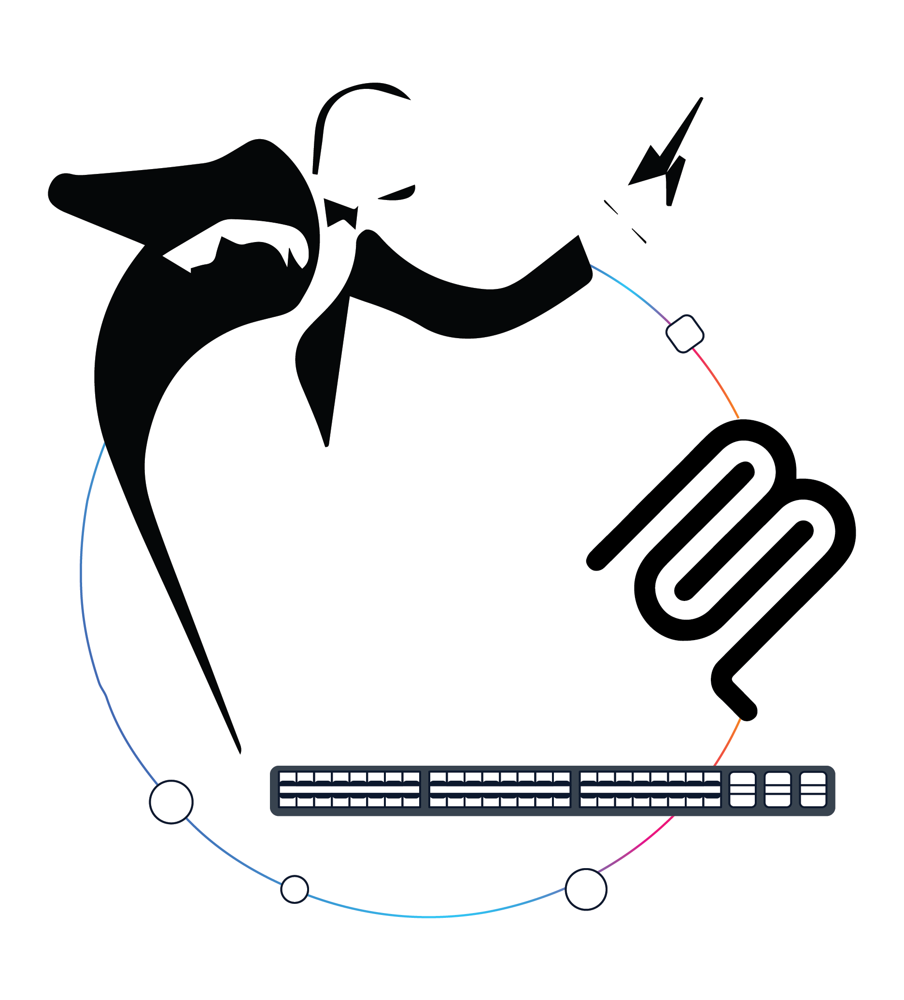
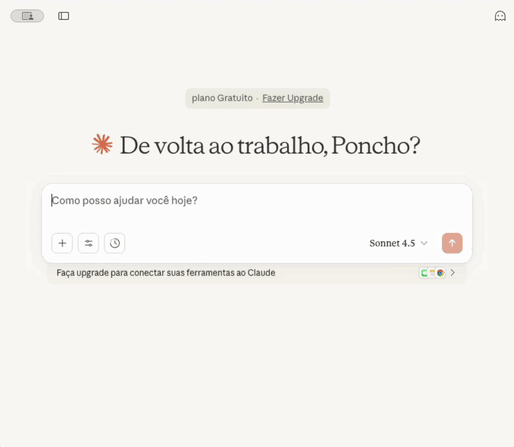
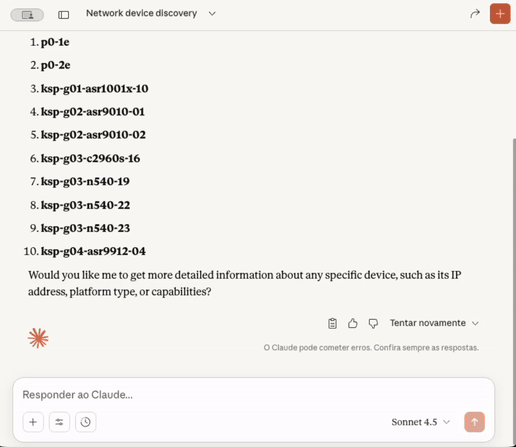
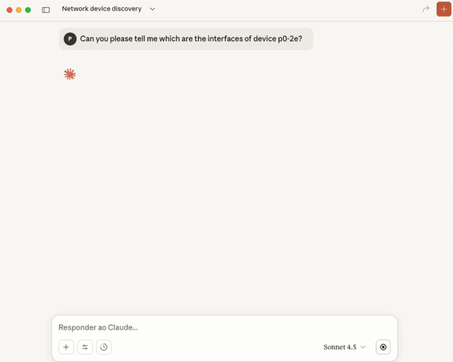
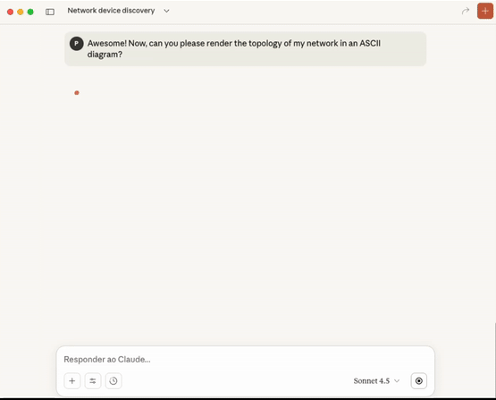
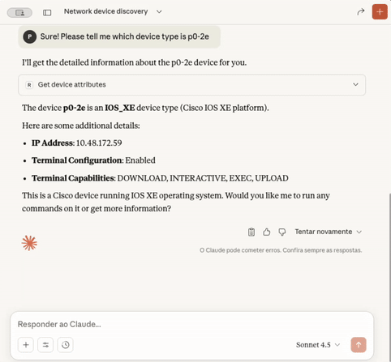

<h1 align="center">✨🤖 Cisco RADKit MCP Server<br /><br />
<div align="center">

</div>

<div align="center">
<a href="https://developer.cisco.com/codeexchange/github/repo/CiscoDevNet/radkit-mcp-server-community"></a>


</div>
<div align="center">
<a href="https://deepwiki.com/CiscoDevNet/radkit-mcp-server-community"></a>
<a href="https://www.youtube.com/watch?v=lsj05owx2Q0">
  
</a>
</div>

</h1>

<div align="center">
A <strong>stand-alone MCP server</strong> built with <a href="https://github.com/modelcontextprotocol/fastmcp"><strong>FastMCP</strong></a> that exposes key functionalities of the <a href="https://radkit.cisco.com/"><strong>Cisco RADKit</strong></a> SDK as MCP tools. It is designed to be connected to any <strong>MCP client</strong> and <strong>LLM</strong> of your choice, enabling intelligent interaction with network devices through Cisco RADKit.
<br /><br />
</div>

> **Disclaimer**: This MCP Server is **example/proof-of-concept code** developed for experimentation and learning purposes **only**. It is not an official Cisco product. **Before deploying in any production environment, review the [Security Notice](#-security-notice) section for important information about network exposure, authentication, and access controls.**

---

## Table of Contents

1. [Overview](#-overview)
2. [Features](#️-features)
3. [Requirements](#-requirements)
4. [Installation](#️-installation)
5. [Authentication](#-authentication)
   - [Option 1: Local Certificates (Development)](#option-1-local-certificates-recommended-for-development)
   - [Option 2: Environment Variables (Containers)](#option-2-environment-variables-recommended-for-containers)
   - [Option 3: Direct RPC](#option-3-direct-rpc)
6. [Running the Server](#-running-the-server)
7. [Available MCP Tools](#-available-mcp-tools)
8. [Container Deployment](#-container-deployment)
9. [Testing](#-testing)
10. [Usage Example: Claude Desktop](#️-usage-example-claude-desktop)

---

## 🚀 Overview

This MCP server acts as a lightweight middleware layer between the **Cisco RADKit** service and an **MCP-compatible client**. It allows an LLM to inspect and interact with devices onboarded in the RADKit inventory, fetch device attributes, and execute CLI commands — all through structured MCP tools.

## ⚙️ Features

- 🔌 **Plug-and-play** — works with any MCP-compatible client.
- 🔍 **Inventory discovery** — list all onboarded network devices.
- 🧠 **Device introspection** — fetch device attributes and capabilities.
- 🖥️ **Command execution** — run CLI commands on network devices with timeout and truncation control.
- 📦 **Fully type-hinted tools** for clarity and extensibility.

## 🧩 Requirements

- Python 3.12+
- Active Cisco RADKit service ([setup guide](https://radkit.cisco.com/#Start))
- `uv` Python package manager
- At least one read-only or read-write user onboarded in the RADKit service

**Python dependencies** (pinned in `pyproject.toml`):

| Package | Version |
|---------|---------|
| `cisco_radkit_client` | 1.9.6 |
| `cisco_radkit_common` | 1.9.6 |
| `cisco_radkit_service` | 1.9.6 |
| `fastmcp` | 2.13.1 |


## ⚠️ Security Notice

**This is example/proof-of-concept code intended for learning and evaluation purposes.** Before using in any production environment:

1. **Default Transport:** The default transport is `stdio` (local-only, not network-exposed). This is the most secure configuration.

2. **Network Transports (SSE/HTTP):** If using `sse` or `http` transport:
   - **Do NOT** bind to `0.0.0.0` in production environments without implementing:
     - Proper network-level access controls (firewall rules, network policies)
     - Client authentication mechanisms
     - TLS/SSL encryption for network communications
   - **Default:** The server binds to `127.0.0.1` (localhost) for security

3. **MCP Client Authentication:** Current implementation lacks MCP client authentication. Any client that can reach the server can access all exposed MCP tools, including:
   - `exec_cli_commands_in_device`: arbitrary CLI execution on enrolled devices
   - `snmp_get`: SNMP read access to managed infrastructure
   - Device inventory and attribute enumeration

4. **Recommended for Production:**
   - Keep the default `stdio` transport for local clients (Claude Desktop, etc.)
   - If network transport is required, implement proper authentication at the application level
   - Use network isolation and firewall rules to restrict access
   - Consider adding MCP client authentication middleware (e.g., bearer tokens)
   - Review and understand the security implications before modifying defaults

## 🧰 Available MCP Tools

| Tool | Description | Returns |
|------|-------------|---------|
| `get_device_inventory_names()` | Returns the names of all devices in the RADKit inventory. | `str` |
| `get_device_attributes(target_device)` | Returns detailed JSON attributes for a specific device (name, host, type, SNMP/NETCONF status, capabilities, etc.). | `str` (JSON) |
| `exec_cli_commands_in_device(target_device, cli_commands, timeout?, max_lines?, service_serial?)` | Executes one or more CLI commands on a device. Returns raw string output. | `str` |
| `snmp_get(device_name, oid, service_serial?, timeout?)` | Performs SNMP GET for one or more OIDs on a device. | `list[dict]` |
| `exec_command(device_name, command, service_serial?, timeout?, max_lines?)` | Executes commands and returns structured output (status, truncation info). | `dict\|list[dict]` |

- Start with `get_device_inventory_names()` to discover available devices.
- Use `get_device_attributes()` to inspect a device before running commands.
- Use `exec_cli_commands_in_device()` for raw CLI output; use `exec_command()` when structured response metadata is needed.
- Use `snmp_get()` to poll metrics or retrieve MIB values without CLI access.

## 🚗 Available transport options ##

| Mode | Description |
|------|-------------|
| `stdio` | Standard I/O — for local clients (Claude Desktop, etc.) |
| `sse` | Server-Sent Events over HTTP — for multiple network clients |
| `http` | HTTP — for http environments |

## 🛠️ Installation

Clone the repository and create a local virtual environment:

```bash
git clone https://github.com/ponchotitlan/radkit-mcp-server.git
cd radkit-mcp-server
uv sync --extra onboarding
```

> For Docker, Docker Compose, or Kubernetes deployments, see [Container Deployment](#-container-deployment).

## 🔐 Authentication

The server supports three authentication methods, evaluated in this priority order:

1. **Direct RPC** — if `RADKIT_DIRECT_HOST` and `RADKIT_DIRECT_TOKEN` are set.
2. **Environment variables** — if `RADKIT_CERT_B64` is set.
3. **Local certificate files** — from `~/.radkit/identities/`.

---

### Option 1: Local Certificates (Recommended for Development)

Use the interactive onboarding script to generate certificates and a `.env` file:

```bash
uv run python radkit_onboarding.py
```

**Step 1 — Generate certificates**

Select option `1` and complete the browser-based authentication flow. You will be asked to set a passphrase for the private key.

```
? Choose an option: 1. 👾 Onboard user to non-interactive Cisco RADKit authentication
? Enter Cisco RADKit username: ponchotitlan@cisco.com

A browser window was opened to continue the authentication process.

Authentication result received.
New private key password: ***********
Confirm: ***********
```

> **Important:** Save this passphrase — you will need it in Step 2.

**Step 2 — Generate .env file**

Select option `2` and provide the required details:

```
? Choose an option: 2. 📚 Generate .env file for Cisco RADKit MCP server
? Enter Cisco RADKit username: ponchotitlan@cisco.com
? Enter Cisco RADKit service code: aaaa-bbbb-cccc
? Enter non-interactive authentication password: ***********
? Select MCP transport mode: stdio
```

If you select `http` or `sse`, you will also be prompted for host and port:

```
? Select MCP transport mode: http
? Enter MCP host: 127.0.0.1
? Enter MCP port: 8000
```

⚠️ **Important:** For **local development only**, use `127.0.0.1` (the default). Do **not** use `0.0.0.0` unless you fully understand the security implications and have implemented proper network-level access controls and authentication.

The `.env` file is saved in the project root. The server auto-detects certificates from `~/.radkit/identities/` — no additional configuration needed.

✅ **Your MCP server is ready to run.**

---

### Option 2: Environment Variables (Recommended for Containers)

Use this method for Docker, Kubernetes, or any environment without local file access.

Generate the `.env` file from your existing local certificates:

```bash
python scripts/build_env.py
```

This script reads your RADKit certificates from `~/.radkit/identities/`, Base64-encodes them, and writes a `.env` file with the following variables:

```bash
RADKIT_IDENTITY=user@cisco.com
RADKIT_DEFAULT_SERVICE_SERIAL=service-serial
RADKIT_CERT_B64=<base64-encoded-cert>
RADKIT_KEY_B64=<base64-encoded-key>
RADKIT_CA_B64=<base64-encoded-ca-chain>
RADKIT_KEY_PASSWORD_B64=<base64-encoded-password>
```

---

### Option 3: Direct RPC

Connect directly to a RADKit server over the local network without cloud-based authentication. Ideal for on-premises or air-gapped deployments.

**Step 1** — Log in to your RADKit Web UI and copy the E2EE validation token for your user account.

**Step 2** — Add the following to your `.env` file:

```bash
RADKIT_IDENTITY=user@example.com
RADKIT_DIRECT_HOST=192.168.1.100        # IP or hostname of your RADKit server
RADKIT_DIRECT_TOKEN=your-e2ee-token     # E2EE validation token from the Web UI
# RADKIT_DIRECT_PORT=8181               # Optional, default is 8181

MCP_TRANSPORT=sse   # or stdio / http
MCP_HOST=127.0.0.1  # Default to localhost for security; only change if you understand network exposure risks
MCP_PORT=8000
```

> `RADKIT_DEFAULT_SERVICE_SERIAL` is **not** required in Direct RPC mode.

**Step 3** — Start the server. On successful connection, you will see:

```
Using authentication mode: direct_rpc
Connecting directly to RADKit server at 192.168.1.100:8181...
✓ Connected directly to RADKit server at 192.168.1.100:8181
```

## 🚀 Running the Server

### Method 1: Direct Python
```bash
python mcp_server.py
```

### Method 2: FastMCP Dev Mode (auto-reload on file changes)
```bash
fastmcp dev src/radkit_mcp/server.py
```

### Method 3: FastMCP Run
```bash
# STDIO (for local clients like Claude Desktop)
fastmcp run src/radkit_mcp/server.py

# SSE (for network access)
fastmcp run src/radkit_mcp/server.py --transport sse --port 8000

# HTTPS (secure network access)
fastmcp run src/radkit_mcp/server.py --transport https --port 8000
```

### Method 4: Python Module
```bash
python -m radkit_mcp.server
```

## 🐳 Container Deployment

### Dockerfile Example
```dockerfile
FROM python:3.12-slim

WORKDIR /app

# Install dependencies from the default public index.
RUN pip install --no-cache-dir \
    fastmcp==2.13.1 \
    python-dotenv>=1.0.0 \
    pydantic-settings>=2.0.0

# Install RADKit dependencies using RADKit index in addition to PyPI.
RUN pip install --no-cache-dir --extra-index-url https://radkit.cisco.com/pip \
    cisco-radkit-client==1.9.6 \
    cisco-radkit-common==1.9.6 \
    cisco-radkit-service==1.9.6

# Copy application code.
COPY src ./src

# Run server
CMD ["python", "-m", "radkit_mcp.server"]
```

### Docker Compose Example
```yaml
services:
  radkit-mcp:
    build: .
    environment:
      - RADKIT_IDENTITY=user@cisco.com
      - RADKIT_DEFAULT_SERVICE_SERIAL=service-serial
      - RADKIT_CERT_B64=${RADKIT_CERT_B64}
      - RADKIT_KEY_B64=${RADKIT_KEY_B64}
      - RADKIT_CA_B64=${RADKIT_CA_B64}
      - RADKIT_KEY_PASSWORD_B64=${RADKIT_KEY_PASSWORD_B64}
      - MCP_TRANSPORT=sse
      - MCP_HOST=0.0.0.0  # Binds inside the container namespace only, not the host network
      - MCP_PORT=8000
    ports:
      - "127.0.0.1:8000:8000"  # Only the host's loopback can reach it
```

### Kubernetes Deployment
```yaml
apiVersion: apps/v1
kind: Deployment
metadata:
  name: radkit-mcp-server
spec:
  replicas: 1
  selector:
    matchLabels:
      app: radkit-mcp
  template:
    metadata:
      labels:
        app: radkit-mcp
    spec:
      containers:
      - name: radkit-mcp
        image: your-registry/radkit-mcp:2.0
        env:
        - name: RADKIT_IDENTITY
          value: "user@cisco.com"
        - name: RADKIT_DEFAULT_SERVICE_SERIAL
          value: "service-serial"
        - name: RADKIT_CERT_B64
          valueFrom:
            secretKeyRef:
              name: radkit-certs
              key: certificate
        - name: RADKIT_KEY_B64
          valueFrom:
            secretKeyRef:
              name: radkit-certs
              key: private-key
        - name: MCP_HOST
          value: "0.0.0.0"  # Required: Service traffic and kubelet probes arrive on the pod IP, not loopback
        # ... other env vars from secret
```

## 🔌 Direct RPC Connection

In addition to the standard cloud-based connection, this server supports connecting directly to a RADKit server over the network using **Direct RPC**. This is ideal for on-premises deployments or air-gapped environments where cloud connectivity is not available or desired.

> **When to use Direct RPC:** Choose this method when your RADKit server is reachable over the local network and you want to avoid cloud-based certificate authentication entirely.

Instead of going through the Cisco RADKit cloud, the server connects directly to the IP address or hostname of your RADKit server using an E2EE validation token that you obtain from the RADKit Web UI. No certificates are required.

When `RADKIT_DIRECT_HOST` and `RADKIT_DIRECT_TOKEN` are both set, Direct RPC mode is activated automatically and takes priority over all other authentication methods.

**Step 1: Get your E2EE validation token**

Log in to your RADKit Web UI and copy the E2EE validation token for your user account. This token acts as the password for the Direct RPC connection.

**Step 2: Set environment variables**

Add the following variables to your `.env` file:

```bash
# Your RADKit username (email)
RADKIT_IDENTITY=user@example.com

# IP address or hostname of your RADKit server
RADKIT_DIRECT_HOST=192.168.1.100

# E2EE validation token from the RADKit Web UI
RADKIT_DIRECT_TOKEN=your-e2ee-validation-token

# Optional: port to connect to (default is 8181)
# RADKIT_DIRECT_PORT=8181

# Your MCP server details
MCP_TRANSPORT=sse|stdio|http
MCP_HOST=0.0.0.0
MCP_PORT=8000
```

> **Note:** `RADKIT_DEFAULT_SERVICE_SERIAL` is **not** required when using Direct RPC mode.

**Step 3: Run the server**

Start the server normally using any of the supported methods:

```bash
python mcp_server.py
```

The server will log the following on startup when Direct RPC mode is active:

```
Using authentication mode: direct_rpc
Connecting directly to RADKit server at 192.168.1.100:8181...
✓ Connected directly to RADKit server at 192.168.1.100:8181
```

### Docker Compose

To use Direct RPC in a Docker deployment, use the following directly in your `docker-compose.yml`:

```yaml
services:
  radkit-mcp:
    build: .
    environment:
      - RADKIT_IDENTITY=user@example.com
      - RADKIT_DIRECT_HOST=192.168.1.100
      - RADKIT_DIRECT_PORT=8181
      - RADKIT_DIRECT_TOKEN=your-e2ee-validation-token
      - MCP_TRANSPORT=sse
      - MCP_HOST=127.0.0.1  # Default to localhost for security
      - MCP_PORT=8000
    ports:
      - "8000:8000"
      - "8081:8081"
    networks:
      - radkit-net

networks:
  radkit-net:
    driver: bridge
```

## 🧪 Testing

Comprehensive test suite with 95%+ coverage!

### Run All Tests
```bash
.venv/bin/pytest tests/ -v
```

### Run Specific Test Suite
```bash
# Integration tests (RADKit API)
.venv/bin/pytest tests/test_integration.py -v

# MCP protocol tests
.venv/bin/pytest tests/test_mcp_client.py -v
```

### Test Coverage Report
```bash
.venv/bin/pytest tests/ --cov=src/radkit_mcp --cov-report=html
```

## ⚡️ Usage example: Claude Desktop

The Claude Desktop application provides an environment which integrates the Claude LLM and a rich MCP Client compatible with this MCP Server.

To get started, download the [Claude Desktop app](https://claude.ai/download) for your host OS, and choose the LLM usage plan that best fits your needs.

Afterwards, edit the **radkit-mcp-server/claude_desktop_config.json** file included in this repository to point to the **absolute paths** of your _.venv_ and _mcp_server.py_ files:

```json
{
  "mcpServers": {
    "radkit-mcp-server": {
      "command": "/Users/ponchotitlan/Documents/radkit-mcp-server-community/.venv/bin/python",
      "args": [
        "/Users/ponchotitlan/Documents/radkit-mcp-server-community/mcp_server.py"
      ],
      "description": "Cisco RADKit MCP Server - Community"
    }
  }
}
```

Then, copy this file to the location of your Claude Desktop application' configurations. The directory varies depending on your host OS:

🍎 MacOS:
```bash
cp claude_desktop_config.json ~/Library/Application\ Support/Claude 
```

🪟 Windows:
```bash
cp claude_desktop_config.json %APPDATA%\Claude\
```

🐧 Linux:
```bash
cp claude_desktop_config.json ~/.config/Claude/
```

Now, restart your Claude Desktop app. Afterwards, if you navigate to **Configurations/Developer/**, you should see the MCP Server up and running:

<div align="center">
  
</div>

### ✨ Prompt examples

**📚 Show the inventory of your Cisco RADKit service**</br>
One of the MCP server tools provides a list of device names.
<div align="center">
  
</div>

</br>**🎰 Ask specific questions about a device**</br>
Another MCP server tool provides information of the device if available directly in the Cisco RADKit SDK.
<div align="center">
  
</div>

</br>Otherwise, a command is executed in the device via a MCP server tool to get the information required.
<div align="center">
  
</div>

</br>**🗺️ Complex querying using networking data**</br>
The LLM can use the information from multiple data network queries to build, for example, a topology diagram.
<div align="center">
  
</div>

</br>This diagram can be later refined with more information from the network as required.
<div align="center">
  
</div>

</br>**⬇️ Push configurations**</br>
Not everything is query information! **If the Cisco RADKit user onboarded in the MCP server is enabled with Write privileges**, commit operations can take place.
<div align="center">
  
</div>

</br>These are just some examples of what can be done with this MCP server!

---

<div align="center">
    <a href="https://github.com/CiscoDevNet/radkit-mcp-server-community/issues/new">
      
    </a>
    <a href="https://github.com/ponchotitlan/radkit-mcp-server/fork">
      
    </a>
</div>
